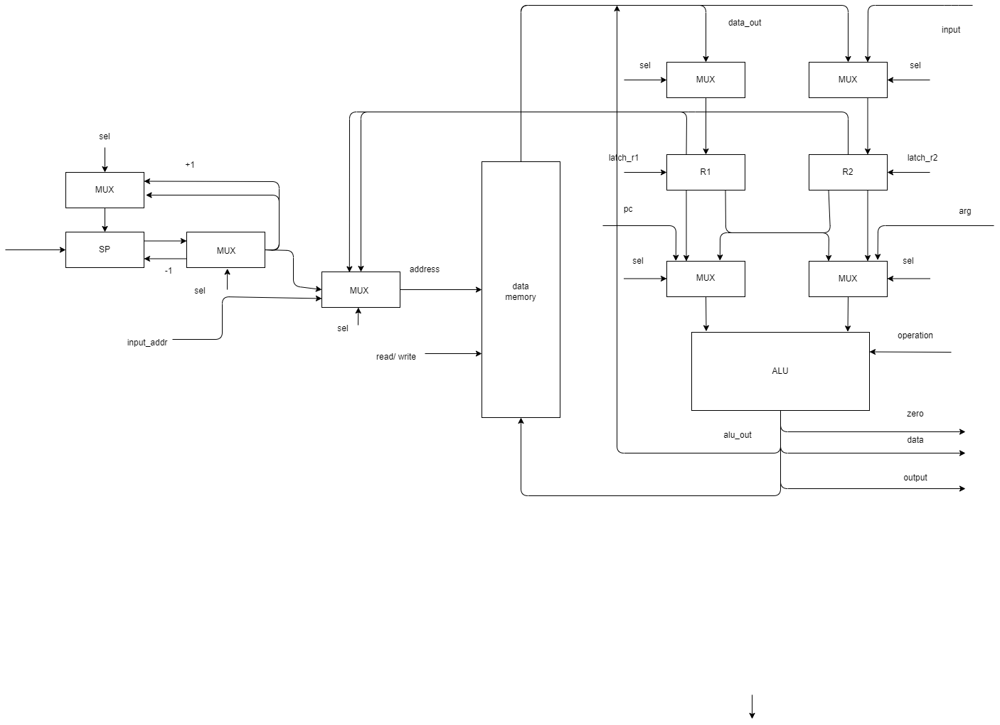
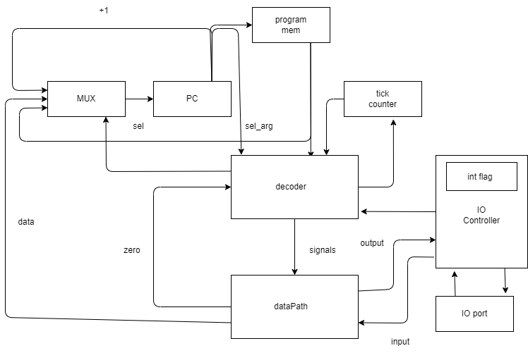

## Отчет

### Шапка

```python
ФИО: Хабнер Георгий Евгеньевич
Группа: P3231
Вариант: asm | risc | harv | hw | instr | binary -> struct | trap -> stream | port | cstr | prob1 | cache
Усложнение: без усложнения
```

---

### Язык программирования

#### Описание синтаксиса

Используется ассемблер для RISC процессора с поддержкой меток. Ниже представлена грамматика в форме Бэкуса-Наура:

```bnf
<program> ::= <line>*
<line> ::= <label> <instruction> | <instruction>

<label> ::= <label_chars> ":"
<label_chars> ::= <label_char> <label_chars>* 
<label_char> ::= any character except ":" and ","

<instruction> ::= <arithmetic_instruction> | <control_instruction> | <memory_instruction> | <output_instruction> | <hlt_instruction> | <comment> | <empty>

<arithmetic_instruction> ::= "ADD" <register> "," <operand>
                           | "SUB" <register> "," <operand>
                           | "MUL" <register> "," <operand>
                           | "DIV" <register> "," <operand>

<control_instruction> ::= "CALL" <address>
                        | "JMP" <address>
                        | "JE" <register> "," <address>

<memory_instruction> ::= "LD" <register> "," <address_or_register>
                       | "ST" <register> "," <address_or_register>

<output_instruction> ::= "OUT" <register>

<hlt_instruction> ::= "HLT"

<comment> ::= ";" <comment_text>
<comment_text> ::= <comment_char>*
<comment_char> ::= any character

<empty> ::= ""

<register> ::= "R" <digit>
<digit> ::= "0" | "1" | "2" | "3" | "4" | "5" | "6" | "7" | "8" | "9"

<operand> ::= <register> | <literal>
<address> ::= <literal> | <label_chars>
<address_or_register> ::= <address> | <register>

<literal> ::= <digit> <literal>*
```

Поддерживаются однострочные комментарии, начинающиеся с ;.

Программа обязана иметь метки `START` и `INT`. `START` - точка входа в программу, `INT` - точка обработки прерываний.

#### Описание семантики

- **Стратегия вычислений**: Последовательное выполнение инструкций с возможностью переходов.
- **Области видимости**: Глобальная память данных, доступная всем инструкциям.
- **Типизация**: Неявная типизация, все операции производятся над 16-битными словами.
- **Виды литералов**: Целые числа, (возможно будет поддержка символов, которые будут преобразованы в ASCII).

### Организация памяти

#### Модель памяти процессора

- **Тип памяти**: Раздельная память инструкций и данных.
- **Размеры машинного слова**: 16 бит.
- **Варианты адресации**: Прямая, для LD и ST косвенная по адресу в регистре.

#### Механика отображения программы и данных на процессор

- **Доступные виды памяти и регистров**: Раздельные память инструкций и память данных.
- **Хранение инструкций**: Сериализуется в бинарный файл, который загружается в память инструкций. Первые два байта - адрес лейбла START, далее идут непосредственно инструкции. 0 инструкция всегда неявно добавленный `CALL INT`.
- **Хранение статических и динамических данных**: статические данные не поддерживаются, динамические данные хранятся в памяти данных.

##### Регистры

Регистры общего назначения R1 и R2, используются в качестве операндов инструкций. В R2 также сохраняется введенное значение при прерывании. R1 и R2 - callee-save регистры.

Внутренние регистры:
- `PC` - счетчик команд.
- `SP` - указатель стека.

##### Instruction memory

1024 слова памяти инструкций.

```
+------------------------------+
| 00  : CALL INT               |
| 01  : Instruction 1          |
| 02  : Instruction 2          |
|    ...                       |
| 20  : Instruction n          |
|    ...                       |
+------------------------------+
```

##### Data memory

1024 слова памяти данных.

Снизу растет стек, управляемый регистром `SP`.

```
+------------------------------+
| 00  : Saved R0               |
| 01  : Saved R1               |
| 02  : Saved PC               |
| 03  : Input Value            |
| 04  : variable 2             |
|    ...                       |
| 20  : variable 1             |
|    ...                       |
+------------------------------+
```

#### Работа с различными типами данных

1. **Литералы**:
    - Арифметические операции поддерживают беззнаковые 10-битные литералы в качестве второго операнда.
    - `LD` и `ST` поддерживают 10-битные литералы в качестве адреса в пространстве данных.
    - `JMP`, `JE` и `CALL` поддерживают 10-битные литералы в качестве адреса в памяти инструкций.

2. **Константы**:
    - Не поддерживаются.

3. **Переменные**:
    - Могут быть отображены на регистры или в память данных, упарвляются вручную.

4. **Инструкции**:
    - Хранятся в памяти инструкций.
  
5. **Функции**:
    - При вызове `CALL` сохраняется текущее значение `PC` в стеке, затем происходит переход на указанный адрес. Передача аргументов и возврат значений производится через регистры. Регистры R1 и R2 - callee-save регистры. Выход из функции производится инструкцией `RET`.

6. **Прерывания**:
    - В 0 инструкции должен быть размещен обработчик прерывания или вызов `CALL INT`. При обработке прерывания сохраняются регистры R1, R2 и PC. В R2 сохраняется введенное значение. Выход из прерывания производится инструкцией `RST`.

### Система команд

#### Особенности процессора

- **Типы данных**: 16-битные слова.
- **Машинные слова**: 16 бит.
- **Устройство памяти**: Гарвардская архитектура с раздельными памятью инструкций и данных.
- **Адресация**: Прямая, для LD и ST косвенная по адресу в регистре.
- **Устройство ввода-вывода**: Использует порт-мэппинг с адресацией портов. Вывод данных в порт производится инструкцией `OUT`. Ввод данных из порта производится во время прерывания.
- **Поток управления**: Линейный с возможностью переходов и прерываний.
- **Система прерываний**: При обработке прерывания сохраняются регистры R1, R2 и PC. В R2 сохраняется введенное значение. Далее происходит переход на инструкцию 0, где заранее должен быть размещен обработчик прерывания или вызов `CALL INT`. Выход из прерывания производится инструкцией `RST`.

#### Набор инструкций

| Код операции | Количество тактов | Описание                      |
|--------------|---------------|-------------------------------|
| `ADD`        | 1             | Сложение                      |
| `SUB`        | 1             | Вычитание                     |
| `MUL`        | 1             | Умножение                     |
| `DIV`        | 1             | Деление                       |
| `JMP`        | 1             | Безусловный переход           |
| `JE `        | 1             | Переход, если равно           |
| `LD`         | 1             | Загрузка данных из памяти     |
| `ST`         | 1             | Сохранение данных в память    |
| `OUT`        | 1             | Вывод данных в порт           |
| `RST`        | 3             | Восстановление регистров      |
| `HLT`        | 0             | Остановка процессора          |

#### Способ кодирования инструкций

Инструкции кодируются в бинарном виде.

<!-- ADD SUB MUL DIV 01XXADS/LIT A - выбор (r, r или r/lit) D - dest S - source LIT - literal -->

<!-- распиши красиво данные инструкции -->

| Код операции | Формат инструкции |
|--------------|-------------------|
| `ADD`        | `0100 A D S/LIT`     |
| `SUB`        | `0101 A D S/LIT`     |
| `MUL`        | `0110 A D S/LIT`     |
| `DIV`        | `0111 A D S/LIT`     |

| `JMP`        | `1000 0 ADDR`        |
| `JE `        | `1001 R ADDR`        |
| `CALL`       | `1010 0 ADDR`        |
| `RET`        | `1011 0 ---`         |

| `LD`         | `1100 R ADDR`        |
| `ST`         | `1101 R ADDR`        |
| `OUT`        | `1110 R ---`         |
| `RST`        | `1111 ---`           |

| `HLT`        | `0000 ---`           |

A - выбор (r, r или r/lit) D - dest S - source LIT - literal
R - выбор регистра (0 или 1)
ADDR - адрес в памяти, 10 бит


### Транслятор

#### Консольное приложение

##### Входные данные:

- Имя файла с исходным кодом на ассемблере.
- Имя файла для сохранения машинного кода.

##### Выходные данные:

- Имя файла с машинным кодом.

#### Описание интерфейса командной строки

```bash
$ ./translator.py input.asm output.bin
```

## Модель процессора



