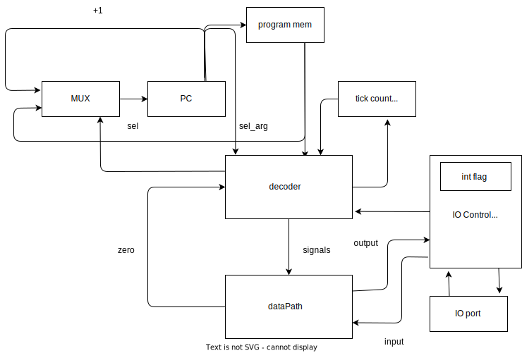

## Отчет

### Шапка

```python
ФИО: Хабнер Георгий Евгеньевич
Группа: P3231
Вариант: asm | risc | harv | hw | instr | binary -> struct | trap -> stream | port | cstr | prob1 | cache
Усложнение: без усложнения
```

---

### Язык программирования

#### Описание синтаксиса

Используется ассемблер для RISC процессора с поддержкой меток. Ниже представлена грамматика в форме Бэкуса-Наура:

```bnf
<program> ::= <line>*
<line> ::= <label> <instruction> | <instruction>

<label> ::= <label_chars> ":"
<label_chars> ::= <label_char> <label_chars>* 
<label_char> ::= any character except ":" and ","

<instruction> ::= <arithmetic_instruction> | <control_instruction> | <memory_instruction> | <output_instruction> | <hlt_instruction> | <comment> | <empty>

<arithmetic_instruction> ::= "ADD" <register> "," <operand>
                           | "SUB" <register> "," <operand>
                           | "MUL" <register> "," <operand>
                           | "DIV" <register> "," <operand>

<control_instruction> ::= "CALL" <address>
                        | "JMP" <address>
                        | "JE" <register> "," <address>

<memory_instruction> ::= "LD" <register> "," <address_or_register>
                       | "ST" <register> "," <address_or_register>

<output_instruction> ::= "OUT" <register>

<hlt_instruction> ::= "HLT"

<comment> ::= ";" <comment_text>
<comment_text> ::= <comment_char>*
<comment_char> ::= any character

<empty> ::= ""

<register> ::= "R" <digit>
<digit> ::= "0" | "1" | "2" | "3" | "4" | "5" | "6" | "7" | "8" | "9"

<operand> ::= <register> | <literal>
<address> ::= <literal> | <label_chars>
<address_or_register> ::= <address> | <register>

<literal> ::= <digit> <literal>*
```

Поддерживаются однострочные комментарии, начинающиеся с ;.

Программа обязана иметь метки `START` и `INT`. `START` - точка входа в программу, `INT` - точка обработки прерываний.

#### Описание семантики

- **Стратегия вычислений**: Последовательное выполнение инструкций с возможностью переходов.
- **Области видимости**: Глобальная память данных, доступная всем инструкциям.
- **Типизация**: Неявная типизация, все операции производятся над 16-битными словами.
- **Виды литералов**: Целые числа.

### Организация памяти

#### Модель памяти процессора

- **Тип памяти**: Раздельная память инструкций и данных.
- **Размеры машинного слова**: 16 бит.
- **Варианты адресации**: Прямая, для LD и ST косвенная по адресу в регистре.

#### Механика отображения программы и данных на процессор

- **Доступные виды памяти и регистров**: Раздельные память инструкций и память данных.
- **Хранение инструкций**: Сериализуется в бинарный файл, который загружается в память инструкций. Первые два байта - адрес лейбла START, далее идут непосредственно инструкции. 0 инструкция всегда неявно добавленный `CALL INT`.
- **Хранение статических и динамических данных**: статические данные не поддерживаются, динамические данные хранятся в памяти данных.

##### Регистры

Регистры общего назначения R1 и R2, используются в качестве операндов инструкций. В R2 также сохраняется введенное значение при прерывании. R1 и R2 - callee-save регистры.

Внутренние регистры:
- `PC` - счетчик команд.
- `SP` - указатель стека.

##### Instruction memory

1024 слова памяти инструкций.

```
+------------------------------+
| 00  : CALL INT               |
| 01  : Instruction 1          |
| 02  : Instruction 2          |
|    ...                       |
| 20  : Instruction n          |
|    ...                       |
+------------------------------+
```

##### Data memory

1024 слова памяти данных.

Снизу растет стек, управляемый регистром `SP`.

```
+------------------------------+
| 00  : Saved R0               |
| 01  : Saved R1               |
| 02  : Saved PC               |
| 03  : Input Value            |
| 04  : variable 2             |
|    ...                       |
| 20  : variable 1             |
|    ...                       |
+------------------------------+
```

#### Работа с различными типами данных

1. **Литералы**:
    - Арифметические операции поддерживают беззнаковые 10-битные литералы в качестве второго операнда.
    - `LD` и `ST` поддерживают 10-битные литералы в качестве адреса в пространстве данных.
    - `JMP`, `JE` и `CALL` поддерживают 10-битные литералы в качестве адреса в памяти инструкций.

2. **Константы**:
    - Не поддерживаются.

3. **Переменные**:
    - Могут быть отображены на регистры или в память данных, упарвляются вручную.

4. **Инструкции**:
    - Хранятся в памяти инструкций.
  
5. **Функции**:
    - При вызове `CALL` сохраняется текущее значение `PC` в стеке, затем происходит переход на указанный адрес. Передача аргументов и возврат значений производится через регистры. Регистры R1 и R2 - callee-save регистры. Выход из функции производится инструкцией `RET`.

6. **Прерывания**:
    - В 0 инструкции должен быть размещен обработчик прерывания или вызов `CALL INT`. При обработке прерывания сохраняются регистры R1, R2 и PC. В R2 сохраняется введенное значение. Выход из прерывания производится инструкцией `RST`.

### Система команд

#### Особенности процессора

- **Типы данных**: 16-битные слова.
- **Машинные слова**: 16 бит.
- **Устройство памяти**: Гарвардская архитектура с раздельными памятью инструкций и данных.
- **Адресация**: Прямая, для LD и ST косвенная по адресу в регистре.
- **Устройство ввода-вывода**: Использует порт-мэппинг с адресацией портов. Вывод данных в порт производится инструкцией `OUT`. Ввод данных из порта производится во время прерывания.
- **Поток управления**: Линейный с возможностью переходов и прерываний.
- **Система прерываний**: При обработке прерывания сохраняются регистры R1, R2 и PC. В R2 сохраняется введенное значение. Далее происходит переход на инструкцию 0, где заранее должен быть размещен обработчик прерывания или вызов `CALL INT`. Выход из прерывания производится инструкцией `RST`.

#### Набор инструкций

| Код операции | Количество тактов | Описание                      |
|--------------|---------------|-------------------------------|
| `ADD`        | 1             | Сложение                      |
| `SUB`        | 1             | Вычитание                     |
| `MUL`        | 1             | Умножение                     |
| `DIV`        | 1             | Деление                       |
| `JMP`        | 1             | Безусловный переход           |
| `JE `        | 1             | Переход, если равно           |
| `CALL`       | 2             | Вызов функции                 |
| `RET`        | 1             | Возврат из функции            |
| `LD`         | 1             | Загрузка данных из памяти     |
| `ST`         | 1             | Сохранение данных в память    |
| `OUT`        | 1             | Вывод данных в порт           |
| `RST`        | 3             | Восстановление регистров      |
| `HLT`        | 0             | Остановка процессора          |

#### Способ кодирования инструкций

Инструкции кодируются в бинарном виде.

* ADD SUB MUL DIV 01XXADS/LIT A - выбор (r, r или r/lit) D - dest S - source LIT - literal

* JMP JE CALL RET 10XXR ADDR R - выбор регистра (0 или 1) ADDR - адрес в памяти, 10 бит (в случаях JMP, CALL и RET R игнорируется, также для RET ADDR игнорируется)

* LD ST OUT 11XXR ADDR R - выбор регистра (0 или 1) ADDR - адрес в памяти, 10 бит (в случае OUT ADDR игнорируется)

* RST HLT 0000 

<!-- распиши красиво данные инструкции -->

| Код операции | Формат инструкции |
|--------------|-------------------|
| `ADD`        | `0100 A D S/LIT`     |
| `SUB`        | `0101 A D S/LIT`     |
| `MUL`        | `0110 A D S/LIT`     |
| `DIV`        | `0111 A D S/LIT`     |
| `JMP`        | `1000 0 ADDR`        |
| `JE `        | `1001 R ADDR`        |
| `CALL`       | `1010 0 ADDR`        |
| `RET`        | `1011 0 ---`         |
| `LD`         | `1100 R ADDR`        |
| `ST`         | `1101 R ADDR`        |
| `OUT`        | `1110 R ---`         |
| `RST`        | `1111 ---`           |
| `HLT`        | `0000 ---`           |

A - выбор (r, r или r/lit) D - dest S - source LIT - literal
R - выбор регистра (0 или 1)
ADDR - адрес в памяти, 10 бит


### Транслятор

#### Консольное приложение

##### Входные данные:

- Имя файла с исходным кодом на ассемблере.

##### Выходные данные:

- Имя файла с машинным кодом.

#### Описание интерфейса командной строки

```bash
$ python -m src.compiler examples/test.asm
```

#### Описание алгоритма работы

0. **Подготовка**: Поиск меток и адреса `START` и замена меток на адреса.
    - Добавление неявной инструкции `CALL INT` в начало программы.
    - Поиск меток в исходном коде.
    - Поиск метки `START` и сохранение ее адреса.
    - Замена всех меток на их адреса в исходном коде.

1. **Парсинг инструкций**: Функция `parse_instructions` принимает список строк (каждая строка представляет собой инструкцию) и начальный индекс. Она возвращает список инструкций, где каждая инструкция представляет собой экземпляр класса `Instruction` или одного из его подклассов.

2. **Обработка каждой строки**: Для каждой строки выполняется следующее:
   - Строка разбивается на части (токены), которые разделяются пробелами. Каждая часть обрабатывается, чтобы удалить запятые и лишние пробелы.
   - Если строка пуста или является комментарием (начинается с `;`), она пропускается.
   - В противном случае первая часть строки считается операцией, и она преобразуется в соответствующий элемент перечисления `Opcode`.

3. **Обработка операций**: В зависимости от операции выполняются различные действия:
   - Для арифметических операций (`ADD`, `SUB`, `MUL`, `DIV`) создается экземпляр класса `ArithmeticInstructionReg` или `ArithmeticInstructionImm`, в зависимости от того, является ли второй операнд регистром или непосредственным значением.
   - Для операции `RET` создается экземпляр класса `RetInstruction`.
   - Для операции `CALL` создается экземпляр класса `CallInstruction`.
   - Для операции `JMP` создается экземпляр класса `JumpInstruction`.
   - Для операции `JE` создается экземпляр класса `JumpEqInstruction`.
   - Для операций `LD` и `ST` создается экземпляр класса `IOMemoryInstructionReg` или `IOMemoryInstructionImm`, в зависимости от того, является ли второй операнд регистром или непосредственным значением.

4. **Возврат программы**: В конце функция возвращает список всех обработанных инструкций в виде объекта `Program`.

## Модель процессора
### ControlUnit


`PC` - счетчик команд.
- `signal_latch_program_counter` - в зависимости от сигнала `PC` либо увеличивается на 1, либо установливается адрес в случае перехода

`decoder` - декодер инструкций, который преобразует машинный код в управляющие сигналы и далее в зависимости от инструкции управляет исполнением инструкции. Также в зависимости от инструкции передает `PC` в `datapath`.
`tick counter` - счетчик тактов. Необходим для реализации прерываний по тактам.
`IO Controller` - контроллер ввода-вывода. Позволяет вводить данные в процессор и выводить данные из процессора. Во время прерывания ставит `interrupt_flag`, который обрабатывается в следующем такте.
- `IO port` необходим для взаимодействия с внешними устройствами. Позволяет вводить данные в процессор и выводить данные из процессора. Предаствляет из себя буферы для ввода, которые считываются во время прерывания, и буфер для вывода, который считывается во время исполнения инструкции `OUT`.

`program memory` - память инструкций. Хранит инструкции, которые исполняются процессором.

Сигналы:

### DataPath


`SP` - указатель стека. Указывает на вершину стека.
`signal_latch_r1` - установление значения регистра R1. В него передаются данные из памяти данных или значение `ALU`. Также сам регистр может быть передан в на шину `addr` для адресации памяти данных.
`signal_latch_r2` - установление значения регистра R2. Аналогично `signal_latch_r1`, но также может принимать входное значение из внешнего устройства.
`execute_alu` - выполнение арифметических операций. В зависимости от сигнала `ALU` выполняется операция сложения, вычитания, умножения или деления. Результат операции передается на шину `alu_out`.
 - `signal_latch_alu_l` - установление значения левого операнда арифметической операции. Может быть передано либо `R1`, `R2` или значение `PC`.
- `signal_latch_alu_r` - установление значения правого операнда арифметической операции. Может быть передано либо `R1`, `R2` или аргумент инструкции.

`signal_read` - чтение данных из памяти данных. Чтение данных из памяти данных по адресу регистра или из стека или по адресу литерала. Далее данные переходят на шину `data_out`.
`signal_write` - запись данных в память данных. Запись данных в память данных по адресу регистра или в стек или по адресу литерала.
`zero_flag` - флаг равенства. Устанавливается в случае равенства регитсра 0. Необходим для выполнения условных переходов.

# Отчет по тестированию

В рамках проекта было проведено модульное и интеграционное (в виде golden-тестов) тестирование различных компонентов системы. Ниже представлены основные тесты и их результаты.

- Модульные тесты для DataPath [tests/test_datapath.py](./tests/test_datapath.py) 
- Модуль ControlUnit был протестирован в файле [tests/test_control_unit.py](./tests/test_control_unit.py)
- Golden-тесты всех стадий (компиляция, симуляция) были проведены в файле [./tests/test_golden.py](./tests/test_golden.py)

Запустить тесты: 
```bash
poetry run pytest . -v
```

Собрать информацию о покрытии тестами: 
```bash
poetry run coverage run -m pytest
peotry run coverage report
```

Обновить конфигурацию golden tests: 
```bash
poetry run pytest . -v --update-goldens
```

Gihub CI настроен в файле [./.github/workflows/ci.yml](./.github/workflows/ci.yml). При каждом пуше в репозиторий запускаются тесты и линтер (ruff).

где:
* poetry - управления зависимостями для языка программирования Python.
* coverage - формирование отчёта об уровне покрытия исходного кода.
* pytest - утилита для запуска тестов.
* ruff - утилита для форматирования и проверки стиля кодирования.

#### Пример работы

Рассмотрим программу [`./examples/cat.asm`](./examples/cat.asm)

Скомпилируем программу:
```bash
python -m src.compiler examples/cat.asm
```

Будет сгенерирован файл `examples/cat.bin`

Создадим файл с планом прерываний [`./examples/cat.input`](./examples/cat.input)

```txt
[(0, 'c'), (10, 'a'), (20, 't'), (30, '\0')]
```

Запустим симуляцию:
```bash
python -m src.machine examples/cat.bin examples/cat.input
```

Вывод:
```txt
INFO:root:Starting simulation
INFO:root:Current State:TICK: 0	PC: 4
ALU_L: 0	ALU_R: 0	ALU_OUT: 0
R1: 0	R2: 0	SP: 255
STACK: []
MEMORY: [0, 0, 0, 0, 0, 0, 0, 0, 0, 0]
Instruction to execute:
IOMemoryInstructionImm(opcode=<Opcode.LD: 12>, dest=<Registers.R1: 0>, src=0, arg_type=<ArgType.IMM: 1>)
INFO:root:
INFO:root:Current State:Interrupted with input: c
TICK: 1	PC: 5
ALU_L: 0	ALU_R: 0	ALU_OUT: 0
R1: 0	R2: 0	SP: 255
STACK: []
MEMORY: [0, 0, 0, 0, 0, 0, 0, 0, 0, 0]

INFO:root:
INFO:root:Current State:TICK: 7	PC: 1
ALU_L: 0	ALU_R: 0	ALU_OUT: 0
R1: 0	R2: 99	SP: 251
STACK: [0, 5, 0, 0]
MEMORY: [0, 0, 0, 0, 0, 0, 0, 0, 0, 0]
Instruction to execute:
IOOutInstruction(opcode=<Opcode.OUT: 14>, src=<Registers.R2: 1>)
INFO:root:
INFO:root:Current State:TICK: 8	PC: 2
ALU_L: 99	ALU_R: 0	ALU_OUT: 99
R1: 0	R2: 99	SP: 251
STACK: [0, 5, 0, 0]
MEMORY: [0, 0, 0, 0, 0, 0, 0, 0, 0, 0]
Instruction to execute:
IOMemoryInstructionImm(opcode=<Opcode.ST: 13>, dest=<Registers.R2: 1>, src=0, arg_type=<ArgType.IMM: 1>)
INFO:root:
INFO:root:Current State:TICK: 9	PC: 3
ALU_L: 99	ALU_R: 0	ALU_OUT: 99
R1: 0	R2: 99	SP: 251
STACK: [0, 5, 0, 0]
MEMORY: [99, 0, 0, 0, 0, 0, 0, 0, 0, 0]
Instruction to execute:
IORstInstruction(opcode=<Opcode.RST: 15>)
INFO:root:
INFO:root:Current State:TICK: 12	PC: 5
ALU_L: 5	ALU_R: 0	ALU_OUT: 5
R1: 0	R2: 0	SP: 255
STACK: []
MEMORY: [99, 0, 0, 0, 0, 0, 0, 0, 0, 0]
Instruction to execute:
JumpEqInstruction(opcode=<Opcode.JE: 9>, src=<Registers.R1: 0>, addr=7)
INFO:root:
INFO:root:Current State:Interrupted with input: a
TICK: 13	PC: 7
ALU_L: 5	ALU_R: 0	ALU_OUT: 5
R1: 0	R2: 0	SP: 255
STACK: []
MEMORY: [99, 0, 0, 0, 0, 0, 0, 0, 0, 0]

INFO:root:
INFO:root:Current State:TICK: 19	PC: 1
ALU_L: 0	ALU_R: 0	ALU_OUT: 0
R1: 0	R2: 97	SP: 251
STACK: [0, 7, 0, 0]
MEMORY: [99, 0, 0, 0, 0, 0, 0, 0, 0, 0]
Instruction to execute:
IOOutInstruction(opcode=<Opcode.OUT: 14>, src=<Registers.R2: 1>)
INFO:root:
INFO:root:Current State:TICK: 20	PC: 2
ALU_L: 97	ALU_R: 0	ALU_OUT: 97
R1: 0	R2: 97	SP: 251
STACK: [0, 7, 0, 0]
MEMORY: [99, 0, 0, 0, 0, 0, 0, 0, 0, 0]
Instruction to execute:
IOMemoryInstructionImm(opcode=<Opcode.ST: 13>, dest=<Registers.R2: 1>, src=0, arg_type=<ArgType.IMM: 1>)
INFO:root:
INFO:root:Current State:Interrupted with input: t
TICK: 21	PC: 3
ALU_L: 97	ALU_R: 0	ALU_OUT: 97
R1: 0	R2: 97	SP: 251
STACK: [0, 7, 0, 0]
MEMORY: [97, 0, 0, 0, 0, 0, 0, 0, 0, 0]

INFO:root:
INFO:root:Current State:TICK: 27	PC: 1
ALU_L: 0	ALU_R: 0	ALU_OUT: 0
R1: 0	R2: 116	SP: 247
STACK: [0, 3, 97, 0, 0, 7, 0, 0]
MEMORY: [97, 0, 0, 0, 0, 0, 0, 0, 0, 0]
Instruction to execute:
IOOutInstruction(opcode=<Opcode.OUT: 14>, src=<Registers.R2: 1>)
INFO:root:
INFO:root:Current State:TICK: 28	PC: 2
ALU_L: 116	ALU_R: 0	ALU_OUT: 116
R1: 0	R2: 116	SP: 247
STACK: [0, 3, 97, 0, 0, 7, 0, 0]
MEMORY: [97, 0, 0, 0, 0, 0, 0, 0, 0, 0]
Instruction to execute:
IOMemoryInstructionImm(opcode=<Opcode.ST: 13>, dest=<Registers.R2: 1>, src=0, arg_type=<ArgType.IMM: 1>)
INFO:root:
INFO:root:Current State:TICK: 29	PC: 3
ALU_L: 116	ALU_R: 0	ALU_OUT: 116
R1: 0	R2: 116	SP: 247
STACK: [0, 3, 97, 0, 0, 7, 0, 0]
MEMORY: [116, 0, 0, 0, 0, 0, 0, 0, 0, 0]
Instruction to execute:
IORstInstruction(opcode=<Opcode.RST: 15>)
INFO:root:
INFO:root:Current State:TICK: 32	PC: 3
ALU_L: 3	ALU_R: 0	ALU_OUT: 3
R1: 0	R2: 97	SP: 251
STACK: [0, 7, 0, 0]
MEMORY: [116, 0, 0, 0, 0, 0, 0, 0, 0, 0]
Instruction to execute:
IORstInstruction(opcode=<Opcode.RST: 15>)
INFO:root:
INFO:root:Current State:Interrupted
TICK: 35	PC: 7
ALU_L: 7	ALU_R: 0	ALU_OUT: 7
R1: 0	R2: 0	SP: 255
STACK: []
MEMORY: [116, 0, 0, 0, 0, 0, 0, 0, 0, 0]

INFO:root:
INFO:root:Current State:TICK: 41	PC: 1
ALU_L: 0	ALU_R: 0	ALU_OUT: 0
R1: 0	R2: 0	SP: 251
STACK: [0, 7, 0, 0]
MEMORY: [116, 0, 0, 0, 0, 0, 0, 0, 0, 0]
Instruction to execute:
IOOutInstruction(opcode=<Opcode.OUT: 14>, src=<Registers.R2: 1>)
INFO:root:
INFO:root:Current State:TICK: 42	PC: 2
ALU_L: 0	ALU_R: 0	ALU_OUT: 0
R1: 0	R2: 0	SP: 251
STACK: [0, 7, 0, 0]
MEMORY: [116, 0, 0, 0, 0, 0, 0, 0, 0, 0]
Instruction to execute:
IOMemoryInstructionImm(opcode=<Opcode.ST: 13>, dest=<Registers.R2: 1>, src=0, arg_type=<ArgType.IMM: 1>)
INFO:root:
INFO:root:Current State:TICK: 43	PC: 3
ALU_L: 0	ALU_R: 0	ALU_OUT: 0
R1: 0	R2: 0	SP: 251
STACK: [0, 7, 0, 0]
MEMORY: [0, 0, 0, 0, 0, 0, 0, 0, 0, 0]
Instruction to execute:
IORstInstruction(opcode=<Opcode.RST: 15>)
INFO:root:
INFO:root:Current State:TICK: 46	PC: 7
ALU_L: 7	ALU_R: 0	ALU_OUT: 7
R1: 0	R2: 0	SP: 255
STACK: []
MEMORY: [0, 0, 0, 0, 0, 0, 0, 0, 0, 0]
Instruction to execute:
ManagementInstruction(opcode=<Opcode.HLT: 0>)
INFO:root:
INFO:root:Simulation finished
INFO:root:Output buffer:
['c', 'a', 't', '\x00']
```

#### Пример проверки покрытия тестами

```bash
poetry run coverage run -m pytest
poetry run coverage report
```

Результат:
```txt
===================================== test session starts ======================================
platform darwin -- Python 3.12.3, pytest-8.2.1, pluggy-1.5.0
rootdir: /Users/georgijhabner/Desktop/ITMO/AK/lab3
configfile: pyproject.toml
plugins: golden-0.2.2
collected 43 items

tests/test_compiler.py .....                                                             [ 11%]
tests/test_control_unit.py ...........                                                   [ 37%]
tests/test_datapath.py ........                                                          [ 55%]
tests/test_golden.py ....                                                                [ 65%]
tests/test_isa.py ...............                                                        [100%]

====================================== 43 passed in 8.38s ======================================
➜  lab3 git:(main) ✗ poetry run coverage report
Name                         Stmts   Miss  Cover
------------------------------------------------
src/__init__.py                  0      0   100%
src/compiler.py                 99      8    92%
src/control_unit.py            154      2    99%
src/datapath.py                 95     13    86%
src/io_controller.py            12      2    83%
src/isa.py                     214      6    97%
src/machine.py                  61      6    90%
src/machine_signals.py          17      0   100%
tests/__init__.py                0      0   100%
tests/test_compiler.py           7      0   100%
tests/test_control_unit.py     106      0   100%
tests/test_datapath.py          76      0   100%
tests/test_golden.py            29      0   100%
tests/test_isa.py                8      0   100%
------------------------------------------------
TOTAL                          878     37    96%
```

| ФИО                            | алг   | LoC | code байт | code инстр. | инстр. | такт. | вариант |
| Хабнер Георгий Евгеньевич      | hello | 69 | 712         | 40         | 39    | 40   | ...     |
| Хабнер Георгий Евгеньевич      | cat   | 12   | 101         | 8           | 46     | 19    | ...     |
| Хабнер Георгий Евгеньевич      | hello_user   | 75   | 887         | 51           | 132     | 103    | ...     |
| Хабнер Георгий Евгеньевич      | prob1   | 47   | 1121         | 25           | 14391     | 14392    | prob1     |
